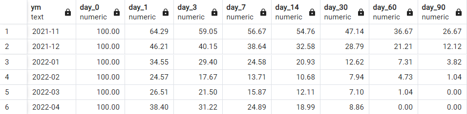

# Platform monetization model update

**Business context**: The ed-tech platform N., which helps candidates prepare for analyst interviews and practice programming skills through problem-solving and tests, aims to change its monetization model.
Currently, monetization is based on an internal currency called CodeCoins. Users earn coins through activity on the platform (for example, by solving problems or passing tests) and spend them on locked tasks and other premium materials. If they don’t have enough coins, they can purchase more with real money.

This system works well for gamification (users enjoy earning coins, spending them, and then earning more), but it has several significant drawbacks:

1) Low marketability -- the internal currency receives virtually no advertising or promotional support
2) Limited promotional flexibility -- it’s difficult to design and run effective campaigns using the currency
3) Low transaction value -- most purchases are for small, inexpensive coin packs
4) Low purchase frequency -- users can buy coins once and have them last for an extended period

The team behind the ed-tech platform N. plans to shift to a classic subscription model. They will offer several pricing plans, allowing users to choose between limited free access or a monthly or annual plan (with substantial discounts for annual subscriptions).

There are several questions the company wants to answer using a data-driven approach. The main ones are:
-- Which subscription periods should be offered (e.g., weekly, monthly, annually)?
-- What should the subscription price be?
-- What features should be included in the subscription? For example, all solutions to the tasks could become paid, or the number of attempts could be limited.

It is important to note several key points (**business hypotheses**) regarding the change in the monetization model, which should be taken into account in future work:

1) All basic platform functionality must remain free (most tasks should be available even in the free version)
2) Some parts of the basic functionality may be removed from the free version and offered as paid. Exactly which parts is not yet clear
3) The paid subscription should include additional features -- for example, top tasks from companies, or extra sections of the site (e.g., case studies or questions)
4) The subscription should be available in several tiers, including at least one short-term plan (for users who want to solve tasks immediately) and one long-term plan (for those who are continuously engaged in self-development)

## Pricing and subscription research

### Summary of actions taken

Wrote SQL queries to support research: 

1) Performed **rolling retention** analysis by user registration date (cohort analysis) — to understand how actively users engage with the platform and how many return after a given period. This analysis helped determine the **optimal duration** for pricing plans (recommendations from the analysis are provided in the report)

